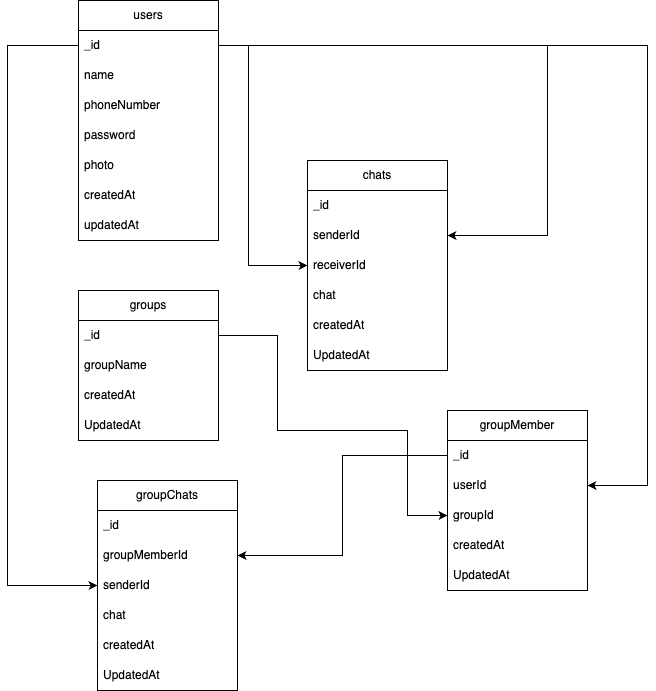

# Web Be Test Point Hub

This is the RESTful API for technical test at Point Hub.

## Installation 

- Make sure you had clone this repo
- Copy environment from `.env.example` to `.env`
- Configure your `.env` file according to your app credentials
- Open your terminal in this project and run 

	```bash
	npm install
	```

## How To Run This RESTful API

- Run On Development

	```bash
	npm run start
	```

- Run On Production

	```bash
	npm run start:prod
	```

- Run Unit Test

	```bash
	npm run test
	```

## Entity Relationship Diagram (ERD)

[](screenshoot/erd.drawio.png)

## License
[MIT](https://choosealicense.com/licenses/mit/)